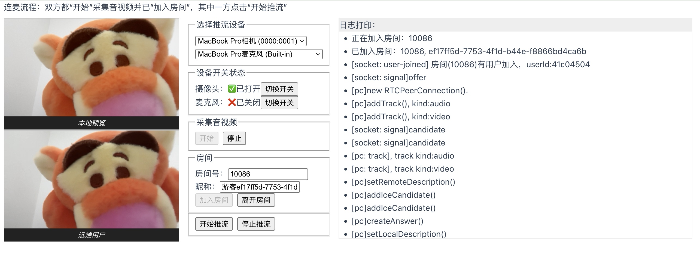

# video-calling-app

A one-to-one video calling application built with WebRTC and JavaScript.

本项目基于 WebRTC 和 Vue 3 实现了简单的一对一音视频通话功能。其中配套使用的*信令服务器*使用 Node.js 和 Express 开发，在 _/server_ 目录下。

项目截图如下：



## 功能

- 局域网内音视频通话
  - 一对一音视频通话
  - 多对多音视频通话
- 支持推流中动态切换推流设备（摄像头/麦克风）
- 支持推流中切换音视频的开关状态

todo：

- 本地录制
- 多视频源
  - 屏幕共享
  - 共享本地多媒体文件
- 断网重连
- 显示音量
- 统计数据并显示

## Recommended IDE Setup

[VSCode](https://code.visualstudio.com/) + [Volar](https://marketplace.visualstudio.com/items?itemName=Vue.volar) (and disable Vetur).

## Type Support for `.vue` Imports in TS

TypeScript cannot handle type information for `.vue` imports by default, so we replace the `tsc` CLI with `vue-tsc` for type checking. In editors, we need [Volar](https://marketplace.visualstudio.com/items?itemName=Vue.volar) to make the TypeScript language service aware of `.vue` types.

## Customize configuration

See [Vite Configuration Reference](https://vite.dev/config/).

## Project Setup

```sh
npm install
```

### Compile and Hot-Reload for Development

```sh
npm run dev
```

### Type-Check, Compile and Minify for Production

```sh
npm run build
```

### Lint with [ESLint](https://eslint.org/)

```sh
npm run lint
```
